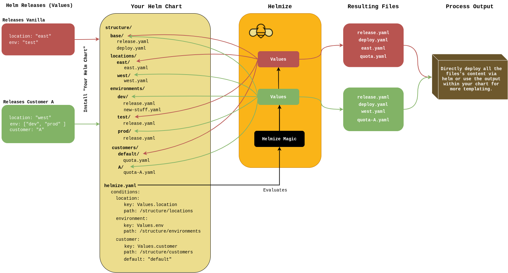

---
---

 
This project is in the early stages of development and still activiely maintained. You may encounter behavior that's not intended when making use of the project.

Helmize is a simple deployment library wrapped in a library helm chart. It's purpose is to simplify complex infrastructure deployments where you change deployed manifests based on given conditions. This project is thought for people that bootstrap complex infrastructure setup on kubernetes and want to simplify their file structure. 

# Concept

# Why

I have created this solution since I did not really find a fiting solution, which would allow me to create 
My first attempt was using Kustomize, which turned out to be a complex folder structure which is from my point of view not easily maintainable. 

* https://github.com/fluxcd/kustomize-controller/issues/414

{{ partial "sidebar.html" . }}